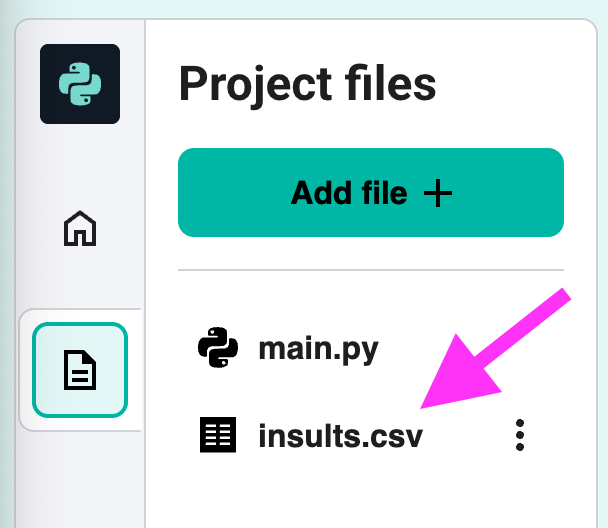
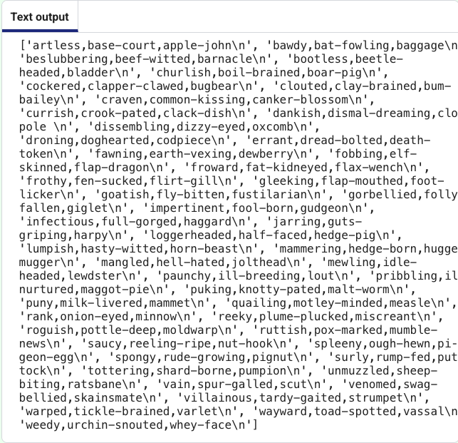

## Open and read from a file

## Step 1

Open the `insults.csv` file and look at the contents.

{:style="width:50%;"}

## Step 2

Click back on the `main.py` file.

Add code to open `insults.csv` in read mode `"r"`, read all of the contents and output the result:

```python filename="main.py" line_numbers="true" line_number_start="1"
with open("insults.csv", "r") as f:
    lines = f.readlines()
    print(lines)
```

## Now run your code

Run your code and check that the text output shows the contents of `insults.csv`.


