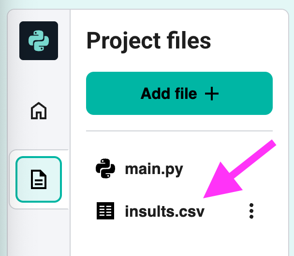
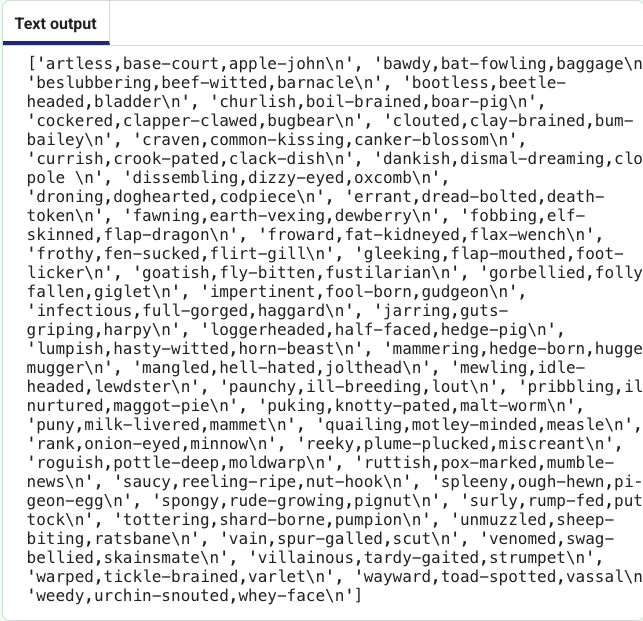

<h2 class="c-project-heading--task">Open and read from a file</h2>

--- task ---

Open the `insults.csv` file and look at the contents. 

{:style="width:50%;"}

--- /task ---

--- task ---

Click back on the `main.py` file. 

Add code to open `insults.csv` in read mode `"r"`, read all of the contents and output the result:

--- code ---
---
language: python
filename: main.py
line_numbers: true
line_number_start: 1
line_highlights: 
---
with open("insults.csv", "r") as f:
  lines = f.readlines()
  print(lines)
--- /code ---

--- /task ---

{:style="width:50%;"}

